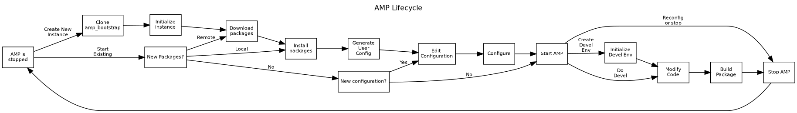

# amp_bootstrap
The AMP Bootstrap provides the utilities needed to install/configure/manage
an AMP installation

If you are running in a containerized environment, the documentation in
[container/README.md](./container/README.md) contains the details for
building and running an AMP container.

The rest of this document assumes that you're installing in a 
bare-metal or VM environment.

# AMP System Requirements

For an OS installation, AMP requires these resources, but more is better:

* 8GB RAM
* 2 CPU
* Disk:
  * 20GB for operating system and AMP software
  * xGB for data files
  * 30GB for development (at least 150G for container dev)

Running AMP has these software requirements:
* RHEL 8-compatible OS
* 3.6 >= Python >= 3.9
* PyYaml
* Java Runtime 11
* Apptainer runtime 1.0
* PostgreSQL >= 12
* Git
* ffmpeg
* gcc, zlib, and other development libraries

Additional requirements for AMP development:
* node 14
* JDK 11
* wget
* make

AMP has been developed using Rocky Linux 8 and should be compatible with
all other RHEL 8 compatible distributions.  Other distributions might be
easily compatible (Fedora, for example), but others will likely be more
difficult (Debian-based distros) but likely possible.


You can use ansible to set up an AMP-compatible environment by using the
[Ansible Installation Instructions](./ansible/README.md).  That process has
been tested on fresh RHEL 8 installs, but it should also work on existing
RHEL 8 installations.  It will not work on non-RHEL 8 distributions.

The environment can also be set up [manually](./docs/manual_setup.md).


# Managing AMP
After all of the system requirements have been installed (either manually or
via ansible) and the amp_bootstrap repository has been cloned into the amp 
user's home directory, the AMP system is ready for management.

The amp_control.py tool provides the functionality needed to manage the AMP
system, from downloading the AMP packages to starting/stopping the system.

Information about the options for amp control can be obtained by using the
`--help` argument on the tool:

```
$ ./amp_control --help
usage: amp_control.py [-h] [--debug] [--config CONFIG] {init,download,start,stop,restart,configure,install} ...

positional arguments:
  {init,download,start,stop,restart,configure,install}
                        Program action
    init                Initialize the AMP installation
    download            Download AMP packages
    start               Start one or more services
    stop                Stop one or more services
    restart             Restart one or more services
    configure           Configure AMP
    install             Install a package

optional arguments:
  -h, --help            show this help message and exit
  --debug               Turn on debugging
  --config CONFIG       Configuration file to use

```


For the remainder of this section of the documentation, assume:
* AMP_ROOT is the location where the amp_bootstrap was cloned.  Usually this
  is the amp user's home directory
* The current directory is the amp_bootstrap.  You should be able to get
  there by running `cd ~/amp_bootstrap`
* Everything is done using the amp system user


An overview of the AMP lifecycle:




## Initialize AMP
First of all needs the directory structures to be initialized.  
```
./amp_control.py init
```

This process only needs to be done once, but it is safe to run additional
times.

# Download the AMP packages
AMP packages are files containing pre-built versions of the AMP software 
components.  These packages can be obtained from 
https://dlib.indiana.edu/AMP-packages/current

The amp_control.py tool can be used to download these packages from the site to
the AMP_ROOT/packages directory.  This may take some time because there is more
than 14G of package data

```
./amp_control.py download https://dlib.indiana.edu/AMP-packages/current ../packages
```

# Install packages
Once the packages are downloaded, they need to be installed.  When new versions
of a package is made available, it can be installed in the same way.

To install all of the downloaded packages, one would run:
```
./amp_control.py install ../packages/*.tar
```
Each package's metadata will be displayed along with prompt to continue, such
as:
```
Package Data for ../packages/amp_python__1.0__x86_64.tar:
  Name: amp_python
  Version: 1.0
  Build date: 20220906_124604
  Architecture: x86_64
  Dependencies: []
  Installation path: /home/amp/amp_python
Continue? 
```
Enter 'y' for each of the packages.

NOTE: packages should be installed only when the system is stopped.

A record of the installations is kept in AMP_ROOT/packagedb.yaml.  This file
is human-readable but is maintained by the software, so do not modify it.

# Configure AMP
Once the system requirements are installed, the AMP system needs to be
configured.  All of the AMP configuration is done through the 
AMP_ROOT/amp_bootstrap/amp.yaml file.  Configuration settings in this file will
overlay any of the default settings that the system ships with.  Generally,
these settings will not need to be modified after the system is initially
configured.

NOTE: The first time the system is configured, it will take a while since
the galaxy system will load all of the prerequisites it needs to run at that
time.

If the amp.yaml file isn't present, an empty one can be generated by running:
```
./amp_control.py configure --user_config amp.yaml
```
This will start the configuration process and generate a default user
configuration file.

If this command is run and the amp.yaml file already 
exists, it will load the configuration from that file prior to overwriting
it.

The basic configuration will look something like this:
```
amp:
  host: localhost
  https: false
  port: 8080
galaxy:
  admin_password: my admin password
  admin_username: myuser@example.edu
  host: localhost
  toolbox:
    Applause Detection:
    - amp_mgms/applause_detection.xml
    - amp_mgms/applause_detection_to_avalon_xml.xml
    Audio Extraction:
    - amp_mgms/extract_audio.xml
    - amp_mgms/remove_trailing_silence.xml
    Audio Segmentation:
    - amp_mgms/ina_speech_segmenter.xml
    - amp_mgms/keep_speech.xml
    - amp_mgms/remove_silence_speech.xml
    - amp_mgms/adjust_transcript_timestamps.xml
    - amp_mgms/adjust_diarization_timestamps.xml
    Facial Recognition:
    - amp_mgms/dlib_face_recognition.xml
    Get Data:
    - data_source/upload.xml
    - amp_mgms/supplement.xml
    Human MGM Editor:
    - amp_mgms/hmgm_transcript.xml
    - amp_mgms/hmgm_ner.xml
    Named Entity Recognition:
    - amp_mgms/spacy.xml
    - amp_mgms/aws_comprehend.xml
    - amp_mgms/ner_to_csv.xml
    Send Data:
    - cloud/send.xml
    Shot Detection:
    - amp_mgms/pyscenedetect.xml
    - amp_mgms/azure_shot_detection.xml
    Speech to Text:
    - amp_mgms/aws_transcribe.xml
    - amp_mgms/gentle_forced_alignment.xml
    - amp_mgms/kaldi.xml
    - amp_mgms/transcript_to_webvtt.xml
    - amp_mgms/vocabulary_tagging.xml
    Video Indexing:
    - amp_mgms/azure_video_indexer.xml
    - amp_mgms/contact_sheet_frame.xml
    - amp_mgms/contact_sheet_face.xml
    - amp_mgms/contact_sheet_shot.xml
    - amp_mgms/contact_sheet_vocr.xml
    Video Optical Charater Recognition:
    - amp_mgms/tesseract.xml
    - amp_mgms/azure_video_ocr.xml
    - amp_mgms/vocr_to_csv.xml
mgms:
  aws:
    aws_access_key_id: my_awsaccess_key
    aws_secret_access_key: my_aws_secret_access
    region_name: us-east-2
  aws_comprehend:
    default_access_arn: arn:aws:iam::<some_number>:role/AwsComprehend
    default_bucket: my-bucket
  aws_transcribe:
    default_bucket: my-bucket
    default_directory: null
  azure:
    accountId: azure_account_id
    apiKey: azure_api_key
    s3Bucket: my-bucket
  hmgm:
    auth_key: some random garbage
    auth_string: auth
  jira:
    password: jira_password
    project: jira_project_key
    server: https://jira.example.edu
    username: jira_username
rest:
  admin_email: ampadmin@example.edu
  admin_password: amppass
  admin_username: ampadmin
  db_host: localhost
  db_name: ampdb
  db_pass: amppass
  db_user: ampuser
ui:
  unit: AMP Pilot Unit
  user_guide:
    AMP_USER_GUIDE: https://uisapp2.iu.edu/confluence-prd/display/AMP/AMP+User+Guide
    COLLECTIONS: https://uisapp2.iu.edu/confluence-prd/display/AMP/Collections
    DELIVERABLES: https://uisapp2.iu.edu/confluence-prd/display/AMP/Deliverables
    ITEMS: https://uisapp2.iu.edu/confluence-prd/display/AMP/Items
    PRIMARY_FILE: https://uisapp2.iu.edu/confluence-prd/display/AMP/Primary+File
    THE_DASHBOARD: https://uisapp2.iu.edu/confluence-prd/display/AMP/The+Dashboard
    UNITS: https://uisapp2.iu.edu/confluence-prd/display/AMP/Units
    UPLOADING_FILES_VIA_BATCH_INGEST: https://uisapp2.iu.edu/confluence-prd/display/AMP/Uploading+Files+via+Batch+Ingest
    WORKFLOW_SUBMISSIONS: https://uisapp2.iu.edu/confluence-prd/display/AMP/Workflow+Submissions
  user_guide_url: https://example.edu/AMP/

```

You can download the file and edit it on your workstation/laptop and then 
upload it or you can edit it directly on the server using `nano amp.yaml`

Use whichever method works best for you.

The yaml file is broken up into different sections and each section has several 
keys & values that can be changed.

Here are the ones that are the most common to modify:
* amp
  * host:  the hostname that will be used for the generated URLs.
  * port:  the base port.  AMP will be accessed via this port and other 
    services will be relative to this port
  * https:  if the service is proxied via https, set this to true
* galaxy
  * host: the hostname that galaxy will listen to.  Usually leave this as 
    localhost since users will not access it directly.
  * admin_username:  this is the administration user for the galaxy.  It is in 
    the form of an email address
  * admin_password:  this is the galaxy administration user password. 
* ui
  * unit:  This is the name of the default unit used in AMP
* rest
  * db_host:  the hostname for the postgres server.  If you're running 
    postgres on the amp machine it will be 'localhost'
  * db_name:  the database name used for amp
  * db_user:  the amp user in postgres
  * db_pass:  the amp user password in postgres
  * admin_username:  the username for the auto-created AMP administration user
  * admin_password:  the password for the auto-created AMP administration user
  * admin_email:  the email address for the auto-created AMP administration user
* mgms
  * aws_comprehend -- settings for AWS comprehend MGM
    * default_bucket:  Bucket used for data transfer
    * default_access_arn:  ARN for access
  * aws_transcribe -- settings for AWS Transcribe
    * default_bucket:  Bucket used for data transfer
    * default_directory: "directory" used in the default bucket (can leave 
      blank)
  * jira -- Settings for JIRA integration
    * server:  base URL
    * username:  Username for AMP to talk to Jira
    * password:  password for AMP to talk to Jira
    * project: Project used for AMP HMGM tasks
  * azure -- Settings for Azure-based services
    * accountId:  account id
    * apiKey: key for azure
    * s3Bucket: bucket used for storage on azure
  * aws -- Generic AWS access settings
    * aws_access_key_id:  access key id
    * aws_secret_access_key: secret access key
    * region_name: region to use
  * hmgm -- HGM settings
    * auth_key:  change to some random text for security
    * Not sure what the rest of these keys do

After the amp.yaml file has been modified, the AMP system needs to be 
reconfigured.  

NOTE: Reconfiguration should only be performed when the system is stopped!

The configuration is applied to the different components by running:
```
./amp_control configure
```

# Start/Stop/Restart AMP

AMP can be started/stopped/restarted by running:

```
./amp_control.py start all
./amp_control.py stop all
./amp_control.py restart all
```

This will perform the requested operation on all of the AMP components in 
the order required.


# Developing AMP
Information about developing the AMP codebase or adding your own packages can be
found [here](./docs/development/developing.md)
